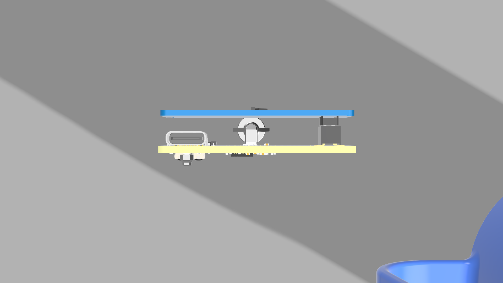

# UPD - mmWave Presence Detection

This is probably the smallest LD2450-based sensor you'll ever see on the market. Our competitors won't be able to make it tinier without using a different module—that's for sure!

---

## Key Features

- **ESP32-C3FH4** MCU with integrated PCB antenna (Wi‑Fi + BLE)
- **LD2450 header pins** for direct module mounting—no adapters, no hassle
- **On-board I²C lux sensor** for ambient light detection
- **USB-C powered** for universal connectivity
- **3.3 V LDO** for clean, stable power delivery
- **Ultra-compact form factor**—as small as physically possible

---

## Connectors & Pin‑out

| Label      | Type         | Description                                 |
|------------|--------------|---------------------------------------------|
| **USB-C**  | Connector    | 5 V power input                             |
| **LD2450** | Header pins  | Direct mount for LD2450 mmWave module       |
| **I²C**    | Pads/Header  | Lux sensor interface (directly on-board)    |
| **BOOT**   | SMD button   | Hold low for ESP32 flash mode               |
| **RST**    | SMD button   | Manual reset (grounds **EN** pin)           |

---

## Power Architecture

- **USB-C input** provides 5 V supply
- **3.3 V LDO** regulates power for the ESP32-C3 and peripherals

---

